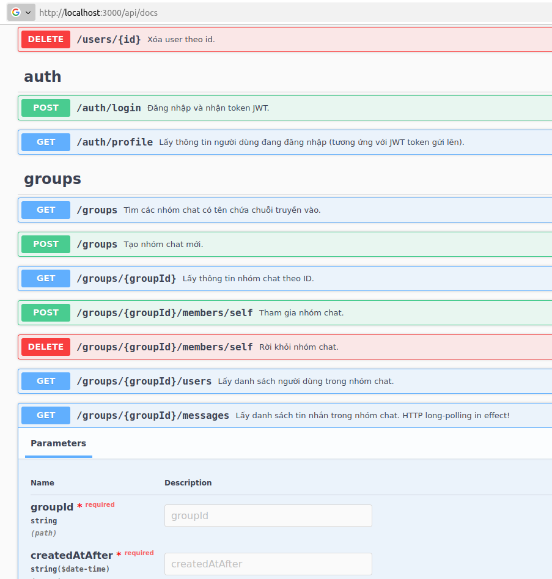
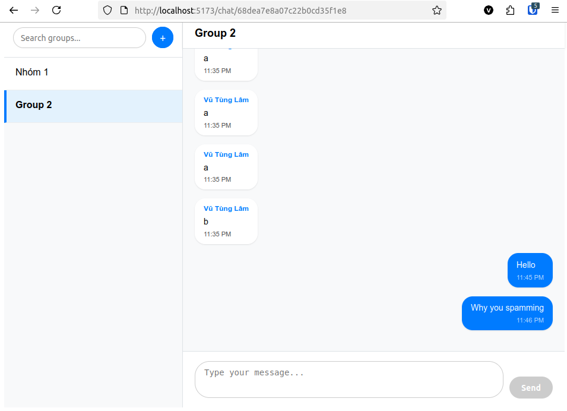
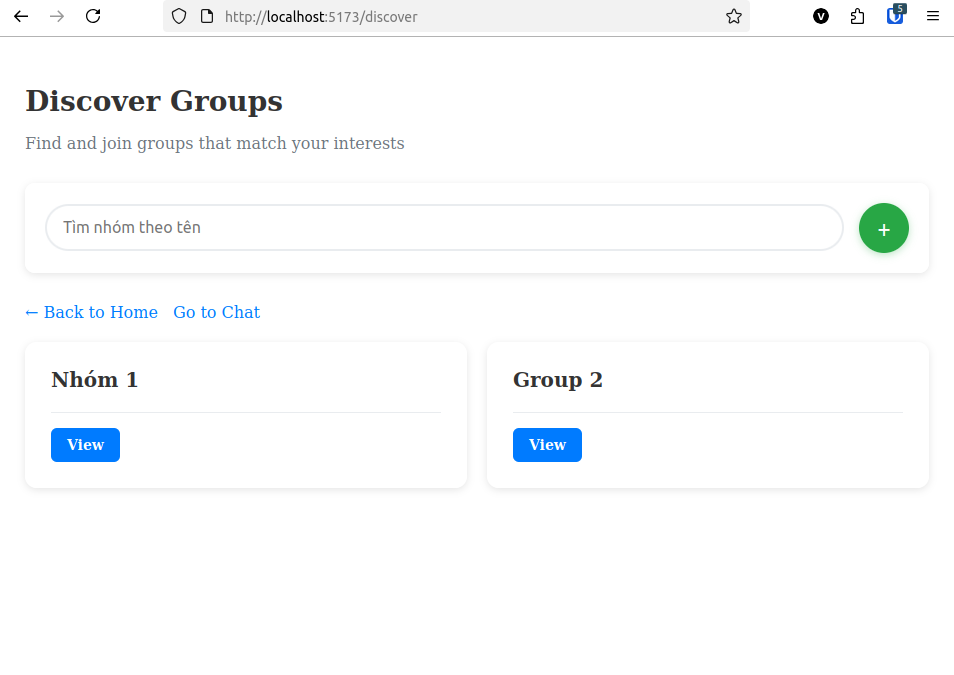
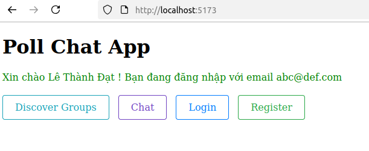

# poll-chat-backend

- [poll-chat-backend](#poll-chat-backend)
  - [Giới thiệu](#giới-thiệu)
  - [Đặc tả yêu cầu](#đặc-tả-yêu-cầu)
    - [Yêu cầu chức năng](#yêu-cầu-chức-năng)
    - [Yêu cầu phi chức năng](#yêu-cầu-phi-chức-năng)
  - [Phương pháp xử lý polling](#phương-pháp-xử-lý-polling)
  - [Cài đặt](#cài-đặt)
  - [Chạy ứng dụng](#chạy-ứng-dụng)
    - [Development](#development)
    - [Development with hot reload](#development-with-hot-reload)
    - [Production](#production)
    - [Run tests](#run-tests)
  - [Chú ý khi viết code](#chú-ý-khi-viết-code)
    - [Swagger API Docs](#swagger-api-docs)
    - [Directory Structure](#directory-structure)
    - [Modules](#modules)
  - [Tác giả](#tác-giả)

## Giới thiệu

Đây là Backend của Poll Chat App.

Frontend của Poll Chat App: <https://github.com/SoA-UET/poll-chat-frontend>

Poll Chat App chứng minh toàn bộ API của một real-time chat
application vẫn có thể hoàn toàn RESTful (RMM level 3).

Đối với việc gửi và nhận tin nhắn tức thì (real-time),
Poll Chat App định nghĩa các REST API endpoints và sử
dụng kỹ thuật HTTP long-polling nhằm đạt yêu cầu real-time.

Nhờ đó, toàn bộ API của Poll Chat App đều thỏa mãn RESTful.









## Đặc tả yêu cầu

### Yêu cầu chức năng

1. Cho phép đăng ký, đăng nhập.
2. Người dùng có thể tạo nhóm (group) từ 1 người trở lên.
3. Người dùng có thể đặt/đổi tên nhóm.
4. Người dùng có thể tìm nhóm theo tên và tham gia nhóm.
5. Người dùng có thể nhắn tin trong nhóm.
6. Người dùng có thể nhận được tin nhắn gửi bởi các thành viên khác trong nhóm theo thời gian thực khi họ online.

### Yêu cầu phi chức năng

1. Tin nhắn phải được gửi đến đúng nhóm, đúng thứ tự theo thời gian được gửi.
2. Trong cùng một nhóm, người đang online sẽ thấy tin nhắn mới trong thời gian dưới 200 (ms) kể từ thời điểm tin nhắn đó được gửi (trong trường hợp không có sự cố mạng, nghẽn mạng).

## Phương pháp xử lý polling

- Khi gửi tin nhắn mới, backend sẽ thêm một message
    vào queue fan-out của RabbitMQ, chứa ID của group
    có message mới.

- Khi client yêu cầu nhận tin nhắn trong một group
    được gửi sau thời gian `X`, backend sẽ truy cập DB,
    và lập tức trả về danh sách tin
    nhắn thỏa mãn nếu danh sách đó không trống. Ngược lại,
    backend chờ tín hiệu của RabbitMQ rằng group ID có
    tin nhắn mới, thì mới query lại DB và trả về
    tin nhắn mới. Tuy vậy sau thời gian timeout `T`,
    nếu không có tín hiệu gì từ RabbitMQ rằng group
    này có tin nhắn mới, backend sẽ trả về danh
    sách rỗng.

- Client nhận được danh sách tin nhắn mới sẽ thêm
    tin nhắn mới (nếu có) vào giao diện chat. Client
    cập nhật biến thời gian `X` bằng thời gian gửi của tin
    nhắn mới nhất mà nó đã nhận được, sau đó lặp lại
    bước yêu cầu nhận tin nhắn phía trên. Như vậy
    đây là kỹ thuật **HTTP long-polling** nhằm đảm
    bảo real-time cho ứng dụng chat, mà vẫn không
    làm API vi phạm ràng buộc REST.

- Thời gian timeout `T` được xác định trong
    `src/common/utils/constants.ts`.

## Cài đặt

1. Cài đặt nodejs dependencies:

    ```sh
    npm i
    ```

2. Cài đặt và chạy:
  - MongoDB Community Edition (MongoDB Server).
  - RabbitMQ

3. Copy file `.env.example` sang file mới tên là `.env`,
    sau đó sửa các biến cho phù hợp.

## Chạy ứng dụng

### Development

```sh
npm run start
```

Mặc định chạy ở <http://0.0.0.0:3000>

### Development with hot reload

```sh
npm run start:dev
```

### Production

```sh
npm run start:prod
```

### Run tests

```sh
# unit tests
$ npm run test

# e2e tests
$ npm run test:e2e

# test coverage
$ npm run test:cov
```

## Chú ý khi viết code

### Swagger API Docs

Truy cập: <http://localhost:3000/api/docs>

OpenAPI JSON: <http://localhost:3000/api-json>

### Directory Structure

    - src/
    |   - users/
    |   |   - users.controller.ts       Controller xử lý người dùng
    |   |   - users.service.ts          Service liên quan
    |   |   - dto/                      Thư mục chứa các DTO
    |   |   |   - create-user.dto.ts    DTO định dạng request khi tạo người dùng mới
    |   |   |   - update-user.dto.ts    DTO định dạng request khi thay đổi thông tin
    |   |   |                           người dùng
    |   |   |   - user.dto.ts           DTO định dạng thông tin người dùng trả về
    |   |   |                           trong response

Khi nhận được HTTP request,
NestJS sẽ gọi controller method
tương ứng. Trong controller method
này sẽ gọi đến service method tương
ứng để xử lý và trả về kết quả.

    HTTP Request ---> Controller ---> Service

                                        |
                                        |
                                        v

    HTTP Response <----------------- Controller

Nghĩa là nên viết service method trước
(trong file `XXX.service.ts`), sau đó
viết controller method (trong file `XXX.controller.ts`).

**Chú ý sử dụng các DTO** để cho phép/ẩn
một số trường nhất định của bảng khi đọc request
hoặc trả về response.

### Modules

Dự án được chia thành các *modules*. Mỗi
module chứa code cho một tính năng (*feature*).

Để thêm một tính năng mới, tạo một
module mới tương ứng:

```sh
cd <project_root>

npx nest generate module $MODULE_NAME
```

## Tác giả

**Group 1 - SoA - UET**

- Nguyễn Mạnh Hùng (Captain)
- Lê Thành Đạt
- Lê Bá Hoàng
- Vũ Tùng Lâm
- Khổng Mạnh Tuấn
